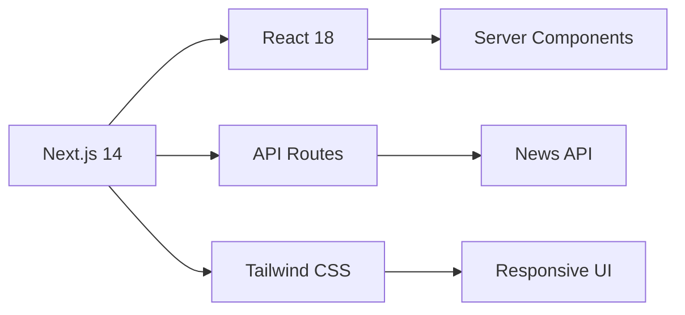

# 📰 PulseNow – Live News Portal

<div align="center">


### *Stay Informed. Stay Ahead. Stay Connected.*

[](https://nextjs.org/)
[](https://reactjs.org/)
[](https://www.typescriptlang.org/)
[](LICENSE)


</div>

---

## ✨ Features

<table>
<tr>
<td width="50%">

### ⚡ Lightning Fast
- **Server-Side Rendering** for instant page loads
- Optimized for **Core Web Vitals**
- SEO-friendly architecture

</td>
<td width="50%">

### 🎯 Smart Navigation
- **Category-based filtering** (Politics, Tech, Sports, etc.)
- **Dynamic routing** for seamless browsing
- Intelligent search functionality

</td>
</tr>
<tr>
<td width="50%">

### 📱 Responsive Design
- Mobile-first approach
- Adaptive layouts for all devices
- Smooth animations & transitions

</td>
<td width="50%">

### 🔄 Real-Time Updates
- Live news aggregation
- Automatic content refresh
- Breaking news notifications

</td>
</tr>
</table>

---

## 🛠️ Tech Stack



| Technology | Purpose |
|------------|---------|
| **Next.js 14** | Framework for SSR & routing |
| **React 18** | UI component library |
| **News API** | Real-time news aggregation |
| **Tailwind CSS** | Utility-first styling |
| **TypeScript** | Type-safe development |

---

## 🚀 Quick Start

### Prerequisites

```bash
node >= 18.0.0
npm >= 9.0.0
```

### Installation

1️⃣ **Clone the repository**
```bash
git clone https://github.com/yourusername/pulsenow.git
cd pulsenow
```

2️⃣ **Install dependencies**
```bash
npm install
# or
yarn install
# or
pnpm install
```

3️⃣ **Set up environment variables**
```bash
cp .env.example .env.local
```

Add your News API key:
```env
NEXT_PUBLIC_NEWS_API_KEY=your_api_key_here
```

4️⃣ **Run the development server**
```bash
npm run dev
# or
yarn dev
# or
pnpm dev
```

5️⃣ **Open your browser**

Navigate to [http://localhost:3000](http://localhost:3000) 🎉

---

## 📁 Project Structure

```
pulsenow/
├── 📂 app/
│   ├── 📂 (routes)/
│   │   ├── 📄 page.tsx          # Home page
│   │   ├── 📂 category/
│   │   │   └── 📄 [slug]/       # Dynamic category pages
│   │   └── 📂 article/
│   │       └── 📄 [id]/         # Article detail pages
│   ├── 📂 api/
│   │   └── 📂 news/             # API routes
│   └── 📄 layout.tsx            # Root layout
├── 📂 components/
│   ├── 📂 ui/                   # Reusable UI components
│   ├── 📄 NewsCard.tsx
│   ├── 📄 CategoryFilter.tsx
│   └── 📄 Header.tsx
├── 📂 lib/
│   ├── 📄 api.ts                # API utilities
│   └── 📄 utils.ts              # Helper functions
├── 📂 public/                   # Static assets
└── 📄 package.json
```

---

## 🎨 Key Features Breakdown

### 🔍 Server-Side Rendering (SSR)

```typescript
// Fast, SEO-optimized content delivery
export async function getServerSideProps() {
  const news = await fetchLatestNews();
  return { props: { news } };
}
```

**Benefits:**
- ⚡ Faster initial page load
- 🔎 Better SEO rankings
- 📊 Improved Core Web Vitals

### 🗂️ Category-Based Filtering

Dynamic filtering across multiple categories:
- 🌍 World News
- 💼 Business
- 💻 Technology
- ⚽ Sports
- 🎬 Entertainment
- 🔬 Science

### 🧭 Dynamic Routing

Seamless navigation with Next.js App Router:
```
/category/technology → Tech news
/article/12345 → Full article view
```

---

## 📸 Screenshots

<div align="center">

### Desktop View


### Mobile View


</div>

---

## 🔧 Available Scripts

| Command | Description |
|---------|-------------|
| `npm run dev` | Start development server |
| `npm run build` | Build for production |
| `npm start` | Start production server |
| `npm run lint` | Run ESLint |
| `npm run type-check` | Run TypeScript checks |

---

## 🌟 Performance Metrics

<div align="center">

| Metric | Score |
|--------|-------|
| ⚡ Performance | 95+ |
| ♿ Accessibility | 100 |
| 🎯 Best Practices | 100 |
| 🔍 SEO | 100 |

*Lighthouse scores on production build*

</div>

---

## 🤝 Contributing

Contributions are what make the open-source community amazing! Any contributions you make are **greatly appreciated**.

1. Fork the Project
2. Create your Feature Branch (`git checkout -b feature/AmazingFeature`)
3. Commit your Changes (`git commit -m 'Add some AmazingFeature'`)
4. Push to the Branch (`git push origin feature/AmazingFeature`)
5. Open a Pull Request

---

## 📝 License

Distributed under the MIT License. See `LICENSE` for more information.

---

## 👨‍💻 Author

**Your Name**

- GitHub: https://github.com/Umanginigam


---

## 🙏 Acknowledgments

- [Next.js Documentation](https://nextjs.org/docs)
- [News API](https://newsapi.org/)
- [Tailwind CSS](https://tailwindcss.com/)
- [React Icons](https://react-icons.github.io/react-icons/)

---

<div align="center">

### ⭐ Star this repo if you found it helpful!

Made with ❤️ and ☕

</div>
